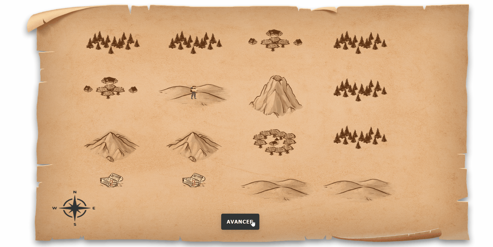
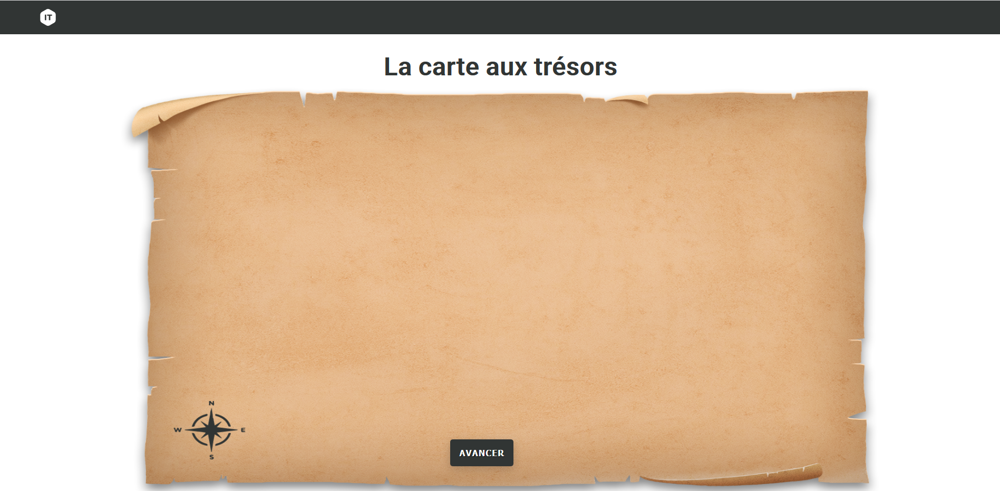
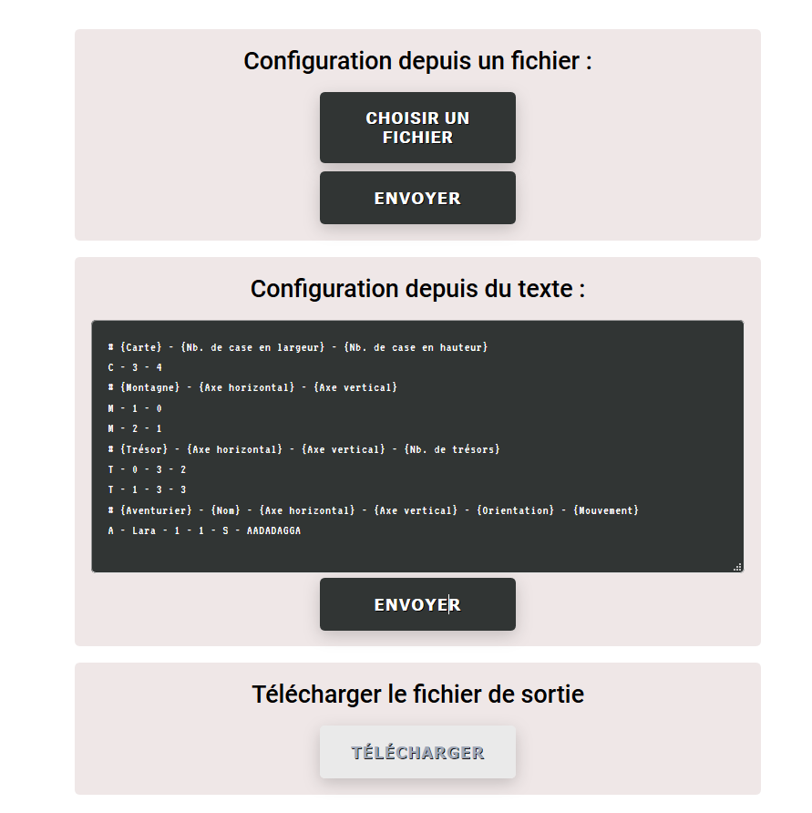
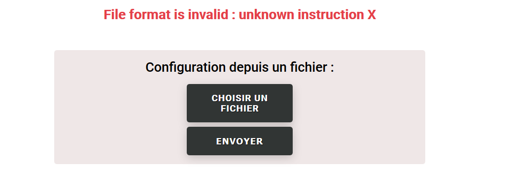
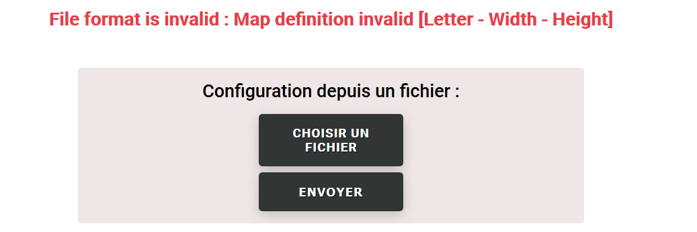

# Treasure-map
## Projet de carte aux trésors

<p> Le gouvernement péruvien vient d’autoriser les aventuriers en quête de trésors à explorer les 85 182
km² du département de la Madre de Dios. Vous devez réaliser un système permettant de suivre les
déplacements et les collectes de trésors effectuées par les aventuriers. Le gouvernement péruvien
étant très à cheval sur les bonnes pratiques de code, il est important de réaliser un code de qualité,
lisible, et maintenable (oui, ça veut dire avec des tests) ! </p>

### Fichier de config attendu :
<div style="text-align:center">

1. {C comme Carte} - {Nb. de case en largeur} - {Nb. de case en hauteur} 

|  letter - number - number |
|  :----:     | 
| C - 3 - 4   | 

<p> </p>

2. {M comme Montagne} - {Axe horizontal} - {Axe vertical}

| letter - number - number   |
|  :----:     | 
|M - 1 - 1  | 

<p> </p>

3. {T comme Trésor} - {Axe horizontal} - {Axe vertical} - {Nb. de trésors} 

| letter - number - number - number |
|  :----:       |
| T - 0 - 3 - 2 | 

<p> </p>

4. {A comme Aventurier} - {Nom de l’aventurier} - {Axe horizontal} - {Axe vertical} - {Orientation} - {Séquence de mouvement}

| letter - string - number - number - letter - string |
|  :----:       |
| A - Indiana - 1 - 1 - S - AADADA | 

<p> </p>

</div>

### Format de sortie attendu :

| Syntax      |
| ----------- |
| C - 3 - 4    |
| M - 1 - 0    | 
| M - 2 - 1       |
| T - 1 - 3 - 2    | 
| C - 3 - 4       |
| A - Lara - 0 - 3 - S - 3    |


### Démonstration 




## Information :
<p>Le projet est décomposé en deux projets : </p>

 * Treasure-map : Application web .NET CORE
 
 * Treasure-map.NUnitTest : Tests unitaires de l'application avec NUnit
 
 <p> Malgré les contraintes de temps je souhaitais réaliser un affichage graphique, tout en répondant au besoin initiale. </p>
 
  * l'UI est une page web statique définie par une feuille de style et un script JavaScript
  
  * L'application .NET CORE gère lecture des instructions ainsi que toute la logique applicative comme la génération de cartes scalable et aléatoire (images affichés).
  
  * L'UI est alimenté par des requêtes HTTP définissant la position des éléments et son évolution.
  
  * Le projet de test permet de valider la couche fonctionnelle de l'application en cas d'évolution
  
 
  
### Insersion de données :
<p>L'insersion des instructions se fait à l'aide de : </p>

un fomulaire `textarea` ou un `fichier.txt`

<p>L'application permet de générer un fichier de sortie indiquant la nouvelle position des points sur la carte</p>
 



<p>Les multiples erreurs lié aux instructions sont gérées et affiché à l'écran</p>
 

 


## Prérequis :
`.NET CORE SDK 5.0`
`IIS sever (IIS Express de Visual Studio ou VSCode extension)`

### Lancer le projet :
<p>Restaurer les dépandances:</p>

```console
dotnet restore 
```
 <p></p>
<p>Construire le projet:</p>

```console
dotnet build 
```
<p></p>
<p>Lancer le projet:</p>

```console
dotnet run 
```

